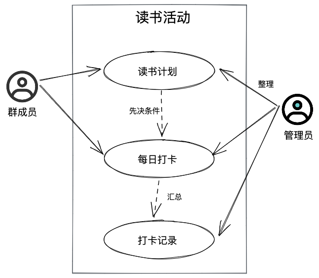
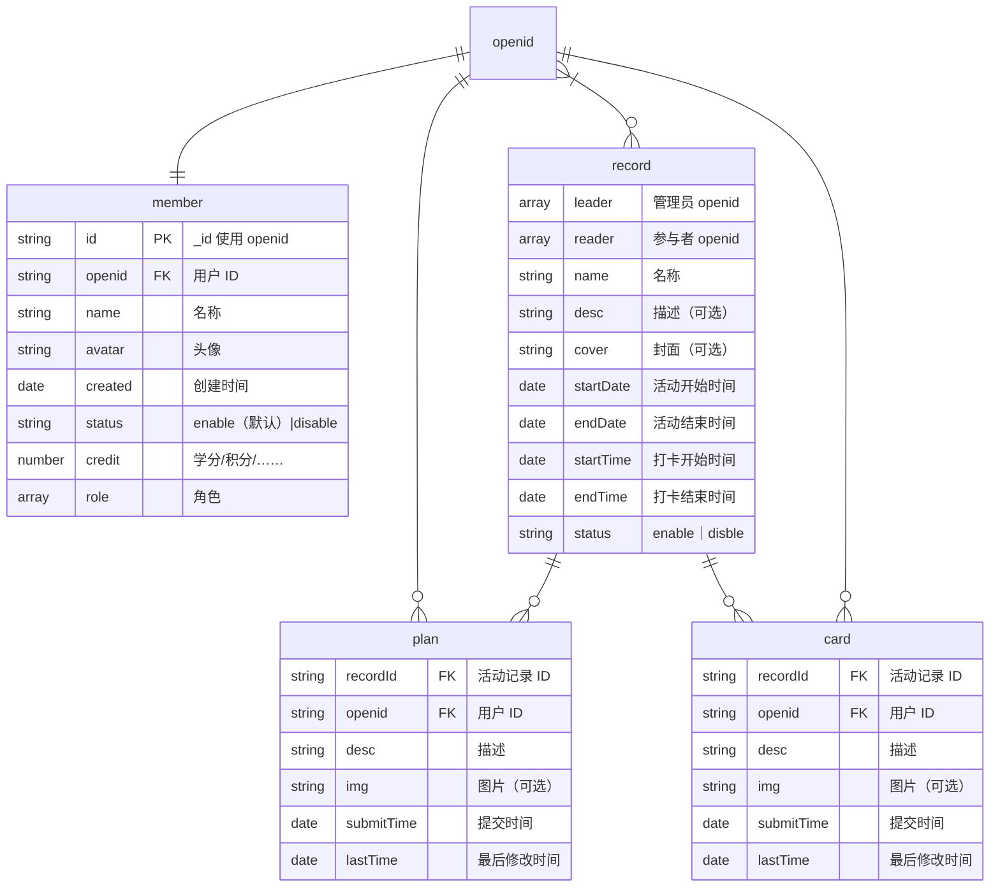

# 开发文档

[需求文档](%E9%9C%80%E6%B1%82%E6%96%87%E6%A1%A3.md)

## 数据库

**必要：**

- 用户信息 - member
- 活动记录 - record
- 读书计划 - plan
- 打卡记录 - card

**可选：**

- 系统配置 - config
- 通知记录 - notice
- 点赞记录 - like

**实体关系图：**

## 相关接口

- [开放能力/用户信息/获取头像昵称](https://developers.weixin.qq.com/miniprogram/dev/framework/open-ability/userProfile.html)
